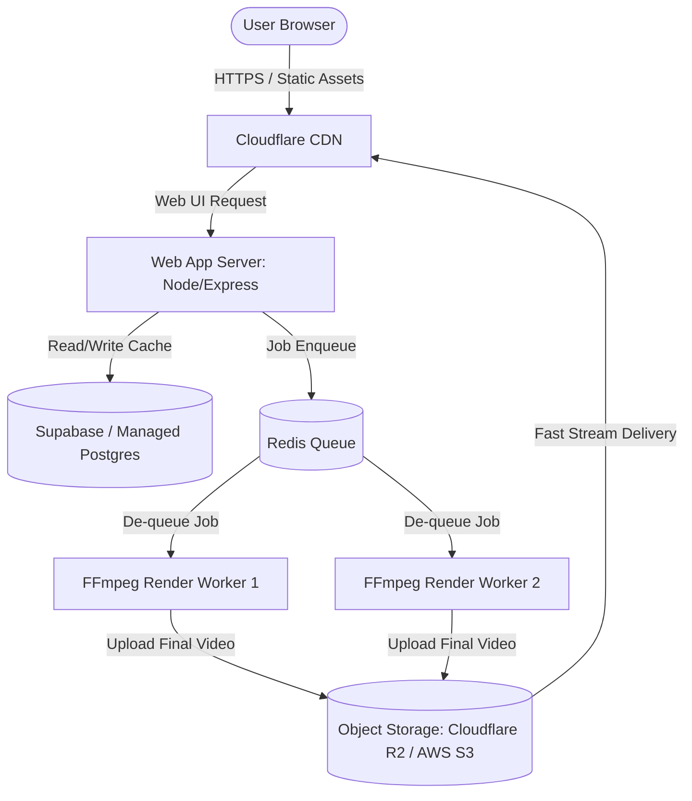

# 🖥️ Server Capacity & Architecture Guide
## Scaling Quranic Studio for 1,000 Users per Hour

**Quranic Studio** is not a typical lightweight CRUD application. Because it contains a **real-time FFmpeg video rendering engine**, its resource profile is heavily dual-natured:
1. **Web Portal (Lightweight)**: Browsing chapters, playing cached videos, managing settings.
2. **FFmpeg Compilation (Resource Intensive)**: Re-encoding background streams, compiling ASS subtitles, applying audio reverb filters, merging waveforms, and rendering high-definition MP4 files.

This document details the hardware specifications and architecture required to serve **1,000 users per hour** reliably.

---

## 📊 Workload Profiling

To size the server correctly, we must divide the 1,000 hourly users into action profiles. A typical Dawah/video platform has a **90-10 distribution**:

| User Profile | Concurrent Actions | Resource Profile | Core Bottleneck |
| :--- | :--- | :--- | :--- |
| **85% Browsing & Streaming** (850 users/hr) Watching generated videos | ~15-20 active streams | Low CPU / Low RAM / High I/O | Network Bandwidth (Egress) |
| **15% Rendering Videos** (150 users/hr) Running the FFmpeg pipeline | ~2.5 renders/minute | Very High CPU / Med RAM / High I/O | CPU Cores & Disk I/O |

---

## 🛠️ Recommended Server Specifications

Depending on your budget and how much video rendering you expect your users to perform simultaneously, choose one of the three tiers below.

### 🟢 Tier 1: Entry Spec (Budget/Shared Rendering)
*Best for: Mostly browsing and static playback, with video renders queued and processed sequentially (one-by-one).*
* **vCPU**: 2 Cores (Intel/AMD or ARM64)
* **RAM**: 4 GB
* **Storage**: 40 GB NVMe SSD (Required for fast video/audio caching and temp frame writing)
* **Bandwidth**: 1 Gbps port with at least 2 TB monthly transfer
* **Estimated Cost**: $12 - $20/month (e.g., DigitalOcean Basic, Hetzner Cloud CX22, AWS t3.medium)
* *Queue Limit*: Configure the queue (`generationQueue.ts`) to allow only **1 parallel render job** to prevent out-of-memory crashes.

### 🟡 Tier 2: Recommended Spec (Concurrent Processing) — **Highly Recommended**
*Best for: Smooth multi-user experience. Handles multiple simultaneous video renders while keeping the web preview lag-free.*
* **vCPU**: 4 Cores (Compute-Optimized preferred, e.g. AWS C-Class or DigitalOcean CPU-Optimized)
* **RAM**: 8 GB
* **Storage**: 80 GB NVMe SSD
* **Bandwidth**: 1 Gbps port with 5 TB+ monthly transfer
* **Estimated Cost**: $40 - $60/month (e.g., Hetzner CCX21, DigitalOcean CPU-Optimized 4GB, AWS c6i.xlarge)
* *Queue Limit*: Configure the queue to allow **2 parallel render jobs**.

### 🔴 Tier 3: Enterprise Spec (High Performance/Zero Queue Lag)
*Best for: Viral traffic campaigns. Processes up to 4 parallel renders simultaneously with high-speed video encoding.*
* **vCPU**: 8+ Cores (Compute-Optimized)
* **RAM**: 16 GB
* **Storage**: 150+ GB Enterprise NVMe SSD
* **Bandwidth**: 10 Gbps port or CDN integration
* **Estimated Cost**: $90 - $150/month
* *Queue Limit*: Configure the queue to allow **4 parallel render jobs**.

---

## ⚙️ Key Bottlenecks & Optimization Strategies

To handle 1,000 users per hour on standard hardware, you **must** apply these configuration updates:

### 1. 🎛️ Network Egress (Bandwidth)
A 30-second vertical HD video is roughly **15 MB - 30 MB**. If 1,000 users watch or download a video, that's **30 GB of egress traffic per hour** (~66 Mbps continuous stream).
* **Fix**: Use a Free **Cloudflare CDN** proxy in front of your domain. Cloudflare will cache your static frontend assets and media previews, offloading 90% of the network load from your origin server.

### 2. 💽 Disk Write Amplification (FFmpeg Temp Files)
FFmpeg writes massive amounts of temporary raw audio/video streams to disk before packaging them into the final `.mp4` container.
* **Fix**: Ensure your server uses an **SSD or NVMe**. Never run this app on traditional HDDs or slow network volumes (like AWS EBS Cold HDD), as the disk queue depth will bottleneck the CPU.

### 3. 🧠 SQLite Concurrent Writes
SQLite is extremely fast for reading, but concurrent writes during queue updates can occasionally trigger a `database is locked` error.
* **Fix**: The engine uses `better-sqlite3` which runs synchronously. Keep the database configuration in WAL (Write-Ahead Logging) mode (which is enabled by default in the engine adapter) to allow simultaneous reads while writing.

---

## 🌐 Production Architecture Checklist

If you are planning to go live with heavy sustained traffic, consider upgrading from the single-server monorepo setup to a **Decoupled Architecture**:

1. **Object Storage Offloading**: Instead of saving generated videos to local disk (`/data/media/library/exports`), update `server.ts` to upload finished MP4s directly to **Cloudflare R2** or **AWS S3** and serve them via CDN. R2 is highly recommended as it has **$0 egress fees**.
2. **Dedicated Render Workers**: Move the video rendering queue out of the Express web server process. Run the web server on a cheap VM (e.g. 2 Cores, 2GB RAM) and pass render payloads via Redis/BullMQ to a dedicated Compute-Optimized worker server that handles the FFmpeg encoding.
3. **Database Migration**: Move SQLite caches to a serverless database like **Supabase** or a managed PostgreSQL instance for absolute data safety and scalability.
